# GST 101: Introduction to Geospatial Technology
## Lab 6 - Understanding Remote Sensing and Analysis
### Objective – Explore and Understand How to Display and Analyze Remotely Sensed Imagery

Document Version: 3/4/2015

**FOSS4G Lab Author:**
Kurt Menke, GISP
Bird's Eye View GIS

**Original Lab Content Author:**
Richard Smith, Ph.D.  
Texas A&M University - Corpus Christi

---

The development of the original document is funded by the Department of Labor (DOL) Trade Adjustment Assistance Community College and Career Training (TAACCCT) Grant No.  TC-22525-11-60-A-48; The National Information Security, Geospatial Technologies Consortium (NISGTC) is an entity of Collin College of Texas, Bellevue College of Washington, Bunker Hill Community College of Massachusetts, Del Mar College of Texas, Moraine Valley Community College of Illinois, Rio Salado College of Arizona, and Salt Lake Community College of Utah.  This work is licensed under the Creative Commons Attribution 3.0 Unported License.  To view a copy of this license, visit http://creativecommons.org/licenses/by/3.0/ or send a letter to Creative Commons, 444 Castro Street, Suite 900, Mountain View, California, 94041, USA.  

This document was original modified from its original form by Kurt Menke and continues to be modified and improved by generous public contributions.

---

### 1. Introduction

In this lab, students will learn how to display and inspect multi-band imagery in QGIS Desktop. They will use QGIS data processing tools to conduct an unsupervised classification of multi-spectral imagery.  They will then use MultiSpec to perform a more advanced analysis. MultiSpec is a freeware multispectral image data analysis system created at the Purdue Research Foundation.  MultiSpec provides the ability to analyze and classify imagery data, among other tasks.  This lab has been adapted from four tutorial exercises provided by the MultiSpec team and provides an introduction to the software package.
This lab includes the following tasks:

+	Task 1 – Display and Inspection of Image Data

+	Task 2 – Unsupervised Classification (Cluster Analysis)

+	Task 3 – Supervised Classification

###	2.	Objective: Learn the Basics of using QGIS Desktop and MultiSpec for Image Analysis

Image analysis is one of the largest uses of remote sensing imagery, especially with imagery that has recorded wavelengths beyond the visible spectrum. There are proprietary software packages designed specifically for remote sensing work such as ENVI and ERDAS Imagine. QGIS Desktop can now be used in combination with two additional FOSS4G software's, SAGA and GRASS, to also conduct image analysis. SAGA and GRASS are both standalone software packages that can be installed separately. However, the main analysis tools from both are now bundled with QGIS Desktop. This means that no additional installations are required in order to use GRASS and SAGA analysis tools via QGIS Desktop. Some of this functionality is for more advanced users. For this reason you will also learn how to use MultiSpec which is a very simple and intuitive, but powerful, freeware image analysis software package. This lab was adapted from the first four tutorials provided by the MultiSpec team. 

##	Task 1		Display and Inspection of Image Data

There are many way to view multi-band image data. Here you will explore some display options for a multi-band image in QGIS Desktop.

1.	The data for this lab is located at GST101\Lab 6\Data on the lab machine. Copy this data to a new working directory of your choosing.

2.	Open QGIS Desktop 2.6.0

3.	Click the Add Raster Layer button and navigate to the Lab 6\Data folder. Set the filter to All Files (*)

4.	Select the file named ag020522_DPAC (Disc Image File, under type) and click Open.

5.	This raster layer does not have a defined coordinate reference system (CRS). Therefore, QGIS opens the Coordinate Reference System Selector window. This lets you define the CRS before the layer is added to the Table of Contents. This raster is in UTM, zone 16, WGS84. Type ‘zone 16’ into the Filter window. In the Coordinate reference systems of the world box you’ll see a list of all the CRS’s with zone 16 in the name. Scroll through until you find WGS/84 UTM zone 16N (EPSG: 32616). Select it so that it appears in the Selected CRS box and click OK (Figure below).

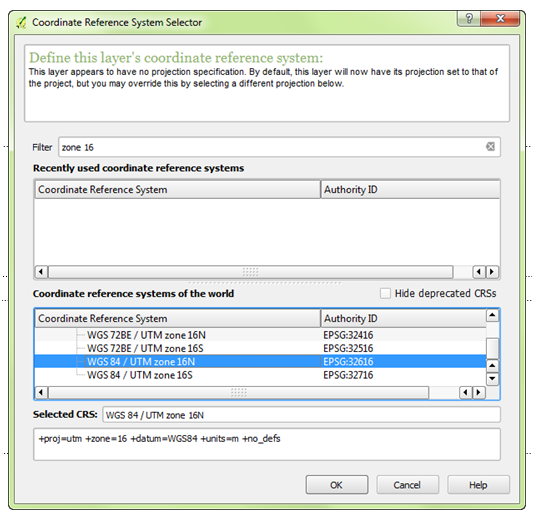

6.	The image will be added to QGIS (Figure below).

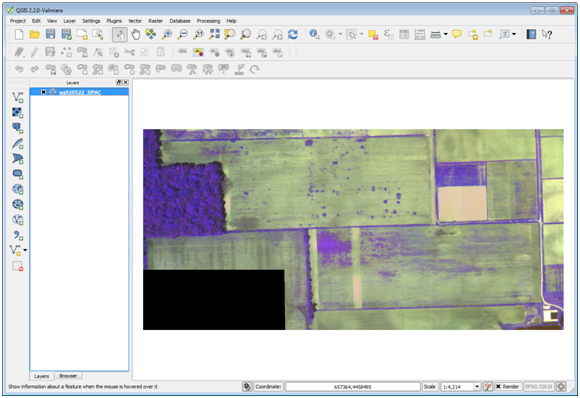

7.	This is an aerial photograph of a portion of the Davis Purdue Agriculture Center in Randolph County, Indiana. 

8.	Save your QGIS Desktop project to your lab folder as Lab 6.qgs

9.	Double click on the layer name in the Table of Contents to open the Layer Properties. Click on the General tab.

10.	Layer info shows you the layer name, where the data are stored on your computer and the number of columns (1,501) and rows (709). Since you set the CRS for the image when you added it to QGIS, the CRS is listed under Coordinate Reference System. Scale dependent visibility allows you to control at what scales the layer is visible. You won’t set this parameter here. If you wanted the image to be visible only at a certain scale range, you could check the box and enter a scale maximum and minimum. There is also a thumbnail view of the image.

This image has three bands. Each band represents a segment of the electromagnetic spectrum. In this case band 1 represents the red portion, band 2 the green portion and band 3 the near-infrared portion. Therefore, in this image we’re able to see characteristics of the landscape that we cannot see with our eyes, since they can only detect visible light.
  
11.	Click on the Style tab. When an image has multiple color bands, QGIS defaults to a Multiband color rendering of that image. Colors on your computer monitor are created by combining three color channels: red, green and blue (RGB). By selecting three bands from a multiband image, and illuminating them with either red, green or blue light we create a color image. The multiband color renderer defaults to displaying Band 1 through the red channel, Band 2 through the green channel and Band 3 through the blue channel. However, we can change which bands  are displayed through which channels. Click the dropdown arrow for the Red band and change it to Band 3. Change the Blue band to Band 1 (Figure below). Click Apply. 

NOTE: The difference between using Apply and using OK. Clicking OK saves the changes and closes the dialog window. Apply saves the changes and leaves the window open. If you want to change a setting, see the result and change another setting use Apply.

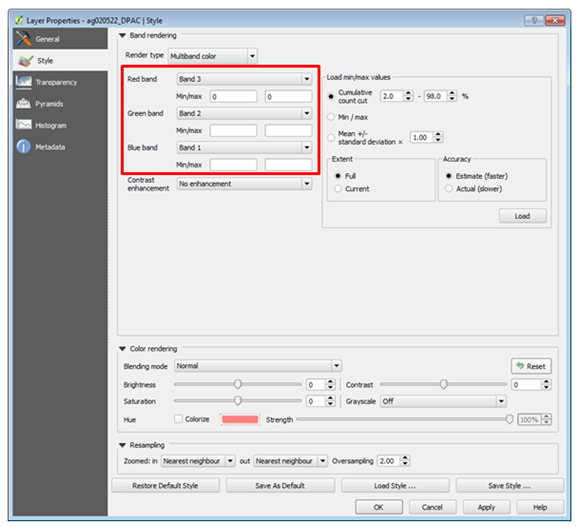

12.	The image should now look like Figure below.This band combination creates what is known as a false color composite. Vegetation reflects a lot of near-infrared energy. You are now looking at the near-infrared through the red channel so vegetation shows up as red tones. The brighter the red, the more vigorous and healthy the vegetation.

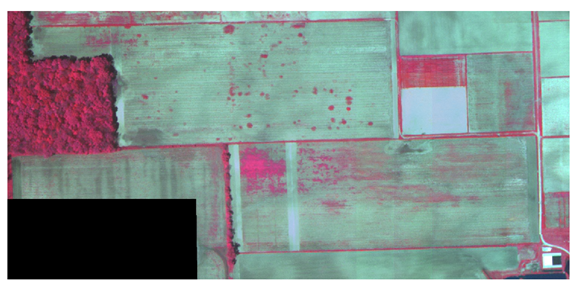

13.	The Style tab also allows you to adjust Contrast enhancement. This setting gives you options to modify the appearance of the image when used in combination with the Load min/max values settings. Each band has values from 0-255. By default, the renderer is set to use Cumulative count cut values from 2% to 98%. This setting eliminates the bottom and top 2% of the values. Many images have some outlying very low and high data values. These outlying data values can be eliminated by using the Cumulative count cut option.  The Contrast enhancement is set by default to No enhancement. Click the Load button to see the values currently being used for each band.

14.	Change the Contrast Enhancement to Stretch to MinMax and click Apply. This setting scales the colors between the minimum and maximum values.  The image gets a little brighter (Figure below) because the colors are now being stretched across the range of values. You are both applying a stretch and eliminating the bottom and top 2% of the values with the default Cumulative count cut setting.

15.	The Accuracy setting lets you either estimate the range of values from a sample or get the actual values. Obtaining actual values can take longer since QGIS has to look at all the values in the image, instead of a sample. Change this setting to Actual, and click the Load button to see the values change slightly.

16.	Now choose a Load min/max values setting of Mean +/- standard deviation and click Load. Click Apply to see the image change. It gets a more saturated appearance (Figure below). These are the values within one standard deviation of the mean value. This is useful when you have one or two cells with abnormally high values in a raster grid that are having a negative impact on the rendering of the raster.

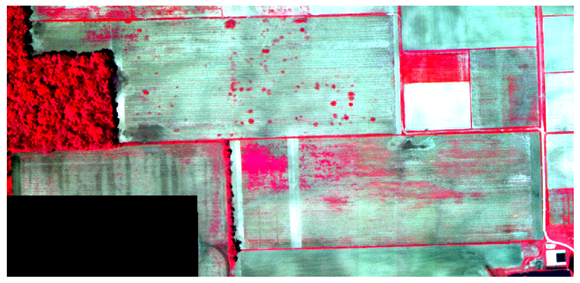

17.	You can also look at one individual band. Change the Render type to Singleband gray. Choose Band 3 as the Gray band. Set the Contrast enhancement to Stretch MinMax. Click Apply.

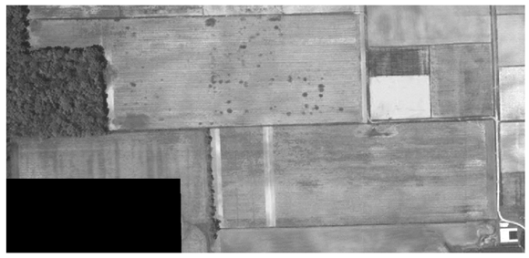

18.	Change the Gray band setting to each of the other two bands and see how different they look.

19.	Change back to a false color composite view: 

	a.	Render type: Multiband color

	b.	Red band = 3

	c.	Green band = 2

	d.	Blue band = 1

	e.	Contrast enhancement = Stretch to MinMax

	f.	Load value

	g.	Click Apply 

20.	Click on the Transparency tab. 

21.	With the Global transparency setting you can control how transparent the entire image is. 

22.	You can also define image values that you want to be transparent. Notice that in the southwest corner there is a black rectangle with no image data. On the Transparency tab click the Add values from display button (Figure 8) then click on the black rectangle on the map. QGIS will measure the values for all three bands where you clicked and enter them into the Transparent pixel list. Click Apply. The black rectangle of no data pixels disappears.

23.	Click on the Pyramids tab. Raster data sets can get very large. Pyramids help render large images more quickly.. Without them QGIS will try to render each pixel in an image even though your monitor may not have enough resolution to display each pixel. Pyramids are lower resolution versions of the image that will increase performance. This particular image is small so you won’t build any now. 

24.	Click on the Histogram tab. Here you can view the distribution of data values in your raster. If it is a multi-band image you can view data for each band. The histogram is generated automatically when you open this tab. You can save the histogram as an image with the Save plot   button (Figure below).

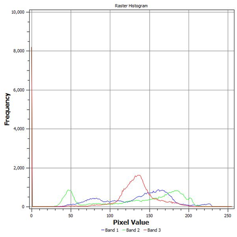

25.	Save your QGIS Desktop project.

##	Task 2		Unsupervised Classification (Cluster Analysis)

We use unsupervised classifications to cluster pixels in a data set based on statistics only, without any user-defined training classes. It can also be used to understand how many clusters or categories of similar pixels exist in an image. Although the method requires no user input to create the classified image, the output tends to require a great deal of post classification operations to make the results more meaningful.

1.	From the menu bar choose Processing -> Toolbox (Figure below).

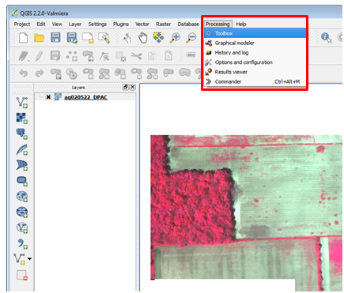

2.	This will open the Processing Toolbox panel. This toolbox contains hundreds of tools for processing both raster and vector data. These are tools imported from several standalone FOSS4G projects: GDAL/OGR, GRASS, Orfeo, SAGA etc. For the unsupervised classification of this image, you will use the SAGA -> Imagery – Classification -> Cluster analysis for grids tool (Figure below).

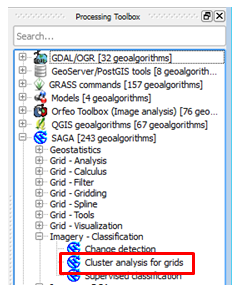

3.	Fill out the Cluster analysis for grids dialog window as follows (Figure below):

	a.	Click the ellipsis button to choose the ag020522_DPAC raster as the input (Figure below).
	
	b.	Set the Method to [2] Combined Minimum Distance/Hillclimbing
	
	c.	Set the number of Clusters to 7 

	d.	There is an option to save the final result to a file on disk. Here just take the default, which is to save the result to a temporary file.
	
	e.	Click Run to run the cluster analysis.

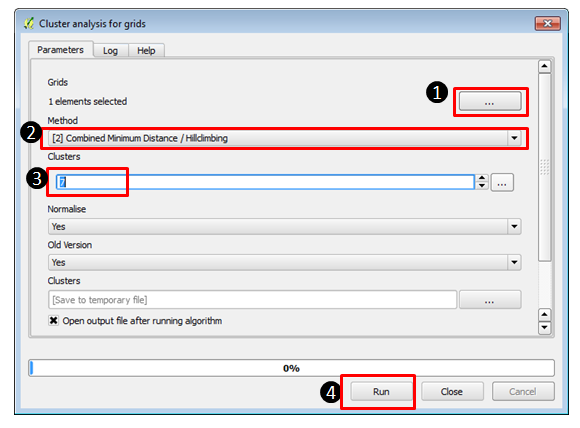

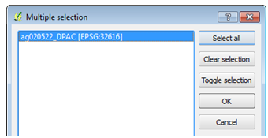

4.	The Clusters raster and a Statistics table will be added to the Table of Contents when it’s complete.

5.	Open the Layer Properties -> Style tab for the Clusters layer. By default, the cluster raster is styled as a Singband gray. You will change this so that each cluster has it’s own color as follows (Figure below):

	a.	Change the Render type to Singleband pseudocolor.

	b.	Keep the default color ramp of Random Colors

	c.	Choose Equal Interval as the Mode.

	d.	Set the number of Classes to 7.

	e.	Click the Classify button and the seven classes will receive unique colors.

	f.	Click Apply.

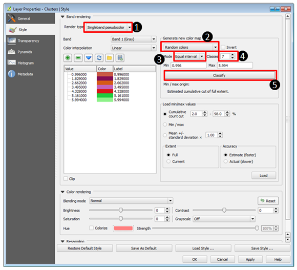

6.	The resulting raster will resemble Figure below although your colors will likely differ since they are randomly chosen by QGIS. You can go into the Style tab again and change individual colors by double clicking on them to open the Change color window. You can also change the labels to text that better represents the objects by clicking and editing the text.

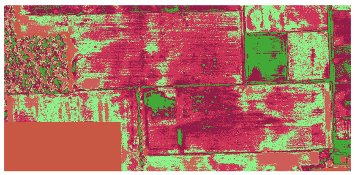

7.	Right click on the Statistics table and choose Open Attribute Table (Figure below). This shows the results of the analysis. For example, the column ‘Elements’ shows the number of pixels in each cluster. Close the window when you are done examining it.

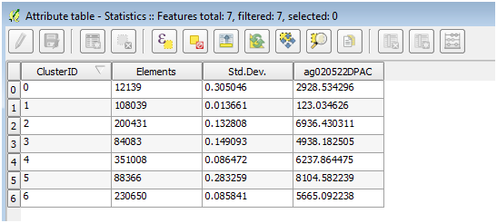

8.	Save your project and close it. In the next task, you will be learning how to use MultiSpec to perform a supervised classification.

##	Task 3		Supervised Classification

In a supervised classification, you choose the areas that to be used as training areas for the analysis. Training areas should be a homogenous sample of a particular feature, such as the forested area in the ag020522_DPAC image. 
For each training area, the multi-spectral (multi-band) pixel values are extracted and used to define a statistical signature. This signature is a statistical representation of a particular class, which is used by the software identify all pixels with a similar signature.

1.	Open MultiSpec by double clicking on the executable file. (GST101\Lab 6\MultiSpec\MultiSpecWin32\MultiSpecW32.exe)

2.	From the menu bar choose File -> Open Image. Choose ag020522_DPAC.img.

3.	The Set Display Specification for: window opens. Take all the defaults and click OK.

4.	MultiSpec should now resemble Figure below. There are two windows the image view and text output. You can arrange them so that you can see both at the same time.

5.	From the menu bar, choose Project -> New Project. Click OK. The Project window will open.

6.	Now you will begin to select training areas. Again, these will be homogenous areas. Start with the forested area. Simply drag a small rectangular area within the forested portion of the image. Note that in the Project box the coordinates (row and column numbers) of the upper left corner and the lower right corner of the selected area appear the box near the bottom. Click Add that field to the list. The Define Class and/or Field Description window opens.

Note: Be careful not to define your training areas near the edges of the field or forest. You should stay away from edges by a couple of pixels to reduce the chance of edge affects. If upon inspection, you don’t like the exact area chosen, you can immediately repeat the process.

7.	Enter the class name of ‘Trees’ and click OK (Figure below).

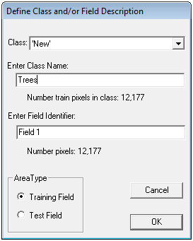

8.	You will define 5 additional training areas. Refer to Figure below. They will be named: ‘Wheat’, ‘Soil’, ‘Light Soil’, ‘No Data’ and ‘Weeds’.

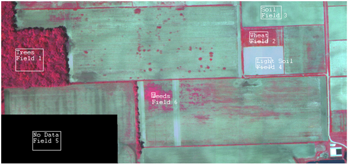

9.	In the Project window click the >Classes button so you see all six of your classes (Figure below).

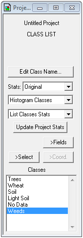

10.	If necessary, you can delete a class by selecting the class in the list and selecting Cut Class from the Edit menu.

11.	From the menu bar choose Processor -> Classify to open the Set Classification Specifications dialog window.

12.	Uncheck Image Selection. The other default settings are fine. Click OK (Figure below). If prompted to ‘Update project statistics before continuing’, click OK.

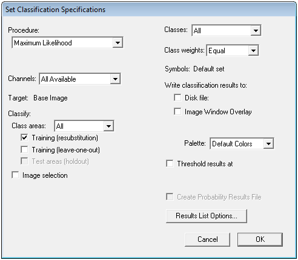

13.	Since Image selection was unchecked (Figure abovr), MultiSpec only estimated the quality of the training areas. You can examine the tabular output to assess if the full analysis should be run. Look at the Text Output window. The TRAINING CLASS PERFORMANCE table tabulates how the pixels of each field and class were classified. The Reference Accuracy (%) should be near 100% for all training fields (Figure below). 

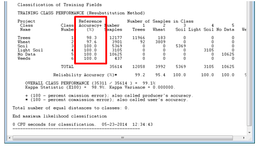

14.	Assuming satisfactory results, you are ready to classify the entire area.

15.	From the menu bar choose Processor -> Classify to open the Set Classification Specifications dialog window.

16.	Set the Classification Specifications as follows (Figure below):

	a.	Uncheck Training (resubstitution)

	b.	Check Image Selection

	c.	Check Disk File under Write classification results to: so that a disk file of the analysis will be created. 

	d.	Check Create Probability Results File

	e.	Click OK.

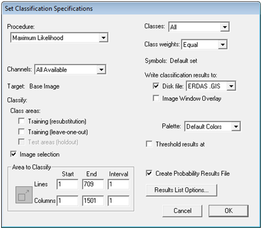

17.	The analysis will run. Shortly you will be prompted to save two resulting files. Take the defaults and click OK both times (Figure below).

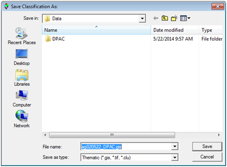

18.	From the menu bar choose File -> Save Project as Lab 6.Prj

19.	 To see the results choose File -> Open Image from the menu bar. Set the Files of type: as Thematic (*.gis; *.tif; *.clu). Select the ag020522_DPAC.gis file and click Open. The Set Thematic Display Specifications window opens. Click OK to take the defaults. The results look much more realistic than those obtained from the unsupervised classification!

20.	To see the training areas superimposed on top of the results go to the menu bar and choose Project -> Add as Associated Image. 

21.	To change the training field outline color, go to the menu bar and choose Processor -> Statistics. The Set Project Options window opens. Under Outline selected areas choose Color: black (Figure below).

22.	To visually evaluate the results you can move your cursor over a color patch in the Table of Contents for one of the classes, hold the shift key down (cursor will change to an open eye) and click the left mouse button  to cause the colors on the map for that class flash on and off.

23.	You can change the colors of the classes by double clicking on the color patch in the Table of Contents and choosing a different color. Change the colors to something more intuitive (Figure below).

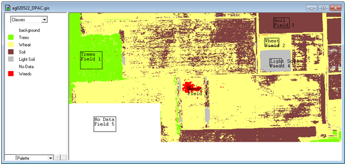

24.	Look at the Text Output. Under the Class Distribution For Selected Area table you’ll see the number of pixels (Number Samples) and the percent of the image that ended up in each class (Figure below).

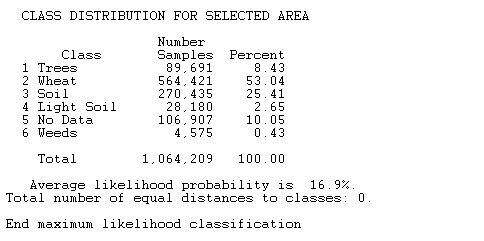

25.	Now you’ll bring the MultiSpec supervised classification results into QGIS Desktop. If necessary Open QGIS Desktop 2.2.0 and from the menu bar choose Project -> Open Recent -> Lab 6.qgs (If you had closed your project the unsupervised classification data will be missing since it those were temporary layers. You will get a Handle bad layers dialog. Just click Cancel to close it. )

26.	Click the Add Raster Layer button and choose the ag020522_DPAC.gis file.

27.	Right click on the layer in the Table of Contents and choose Set Layer CRS from the context menu. Choose WGS84/UTM zone 16N from the Recently used coordinate reference systems. The layer should overlay your image.

28.	Open the Layer Properties for this layer and go to the Style tab.

29.	Choose the following rendering options (Figure below):

	a.	Render type: Singleband pseudocolor

	b.	Keep the default color ramp of Random Colors

	c.	Choose Equal Interval as the Mode.
	
	d.	Set the number of Classes to 6.

	e.	Click the Classify button and the six classes will receive unique colors.
	
	f.	Change the Values to 1-6 to match the class values in the data. Double click on the values to edit them.

	g.	Change the Labels to match the six classes. Double click on the values to edit them. 

	h.	Click on the individual color patches and change them to more intuitive colors.

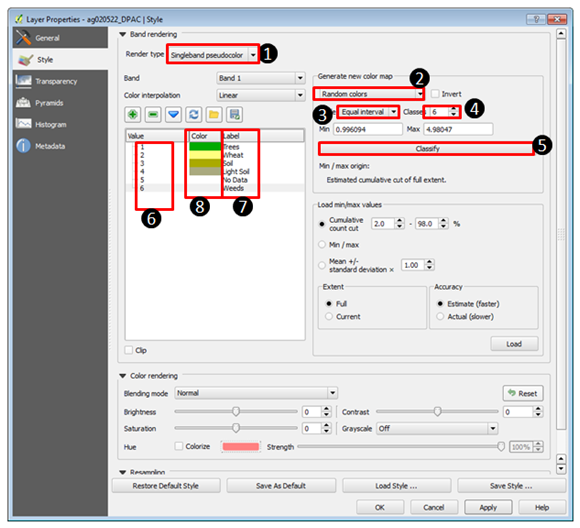

30.	Your data should now resemble Figure below.

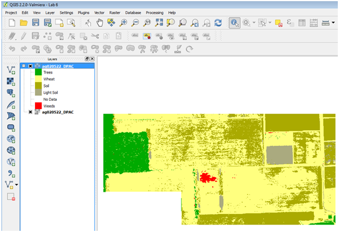

###	5.	Conclusion
In this lab, you have learned the basics of working with multi-spectral imagery in QGIS Desktop. You’ve learned how to access data processing tools in QGIS Desktop and run an unsupervised classification (cluster analysis) on the imagery. You've also learned how to do a Supervised Classification in MultiSpec, a freeware multispectral image data analysis system.  MultiSpec is an excellent example of many free-to-use programs available for imagery analysis and GIS-related tasks.  

###	6.	Discussion Questions

1.	What other objects in imagery could you identify via supervised classification?  Describe two use-cases.

2.	Even though the imagery used in this lab contained recordings of wavelengths beyond the visible spectrum, why do you think each range of hyperspectral information was mapped to the colors red, green, and blue?

3.	In lecture, you learned that photointerpretation is the process of converting images to information through human interpretation.  Based on the results of tasks 2 and 3  in this lab, do you think that computers can interpret as well as humans?

###	7.	Challenge Assignment (optional) 

You have used MultiSpec to perform a Supervised Classification of the multi-spectral imagery. You have also seen that you can do an analysis in MultiSpec and bring the data into QGIS.

Create a simple page sized color map composition using the QGIS Desktop Print Composer showing your results. Show the Supervised Classification. Include:

+	Title

+	Legend (be sure to rename your layers so that the legend will be meaningful.)

+	Date and Data Sources

You can credit the data sources as the Purdue Research Foundation and yourself. If you need to refresh your memory, review GST 101 Lab 4.
